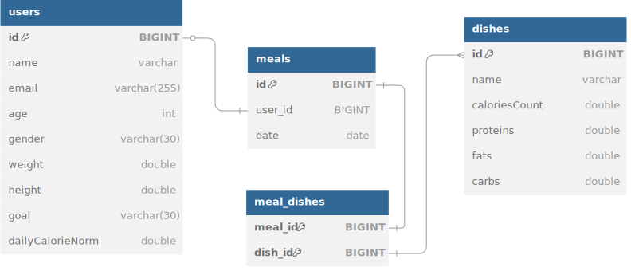

# Calorie counting

git remote add origin git@github.com:AveryanovaKatia/calorie-counting.git пользователя и учета съеденных блюд.

### **Основные возможности:**
- Создание пользователей с параметрами.
- Автоматический рассчет дневной нормы калорий пользователя (с помощью формулы Харриса-Бенедикта).
- Добавление блюд с параметрами.
- Добавление приема пищи со списком блюд.
- Формилование ответов: 
        + отчет за день с суммой всех калорий и приемов пищи;
        + проверка, уложился ли пользователь в свою дневную норму калорий;
        + история питания по дням.

### **Стек технологий:**
#### Java 21, Maven, Spring Boot, Spring Data JPA, PostgreSQL, REST API, Lombok, Slf4j, JUnit.

### **Инструкция по сборке**:

1.Установить необходимые инструменты:

    - JDK 21
    - Maven
    - PostgreSQL 16+

2.Перейти в корневую директорию проекта.

3.Выполнить команду для сборки проекта:

- mvn clean install

### **Инструкция настройки базы данных**:

1. Создайть базу данных:

- CREATE DATABASE calorie_tracker;

2. Настроить пользователя:

- CREATE USER calorie_user WITH PASSWORD 'password';
- GRANT ALL PRIVILEGES ON DATABASE calorie_tracker TO calorie_user;

### **Инструкция по запуску**:

  Выполнить команду:

- java -jar target/calorie-counting-0.0.1-SNAPSHOT.jar

### **Инструкция по тестированию**:

1. Для запуска тестов выполнить:

- mvn test

2. Для запуска тестов через Postman:

- Импортировать Postman-коллекцию;
- Выбрать команду Run Collection.

### **Инструкция по остановке приложения**:

  Сочетание клавиш Ctrl + C остановит программу.

## ER диаграмма

